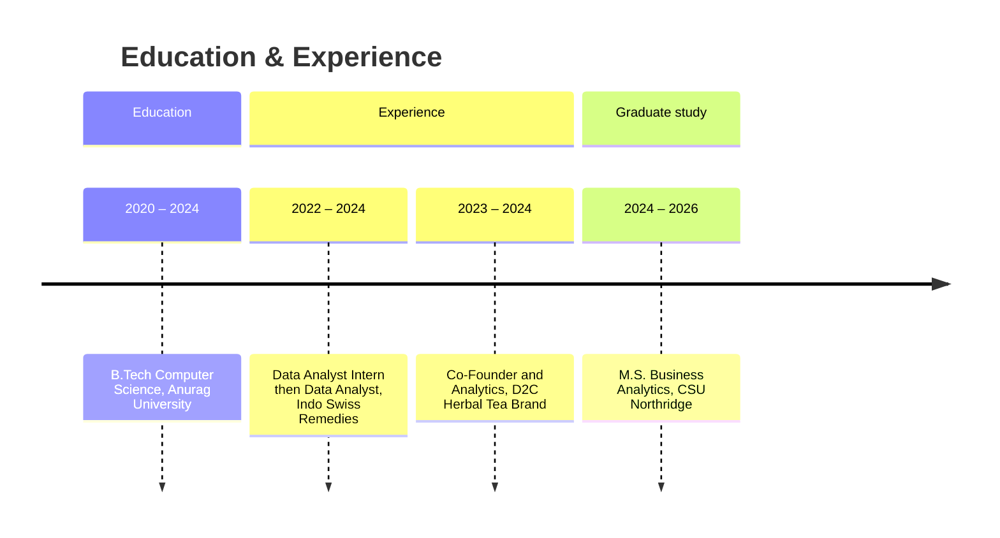

---

## About

I'm a Business Analytics graduate student (M.S., CSUN) and data analyst who turns messy operational data into forecasts, dashboards, and decisions. Over two years at **Indo Swiss Remedies** I built SQL, Power BI, and Python workflows that cut stockouts, automated reporting, and gave leaders visibility across regions and product lines. I also co-founded a D2C tea brand — so I read numbers with a P&L in mind: acquisition, retention, margin, and what actually moves revenue.

`SQL / MySQL / PostgreSQL / T-SQL / Repeat`

🔗 **See the work → [abhinavvarma.com](https://abhinavvarma.com)**

---

## Impact snapshot

| Metric | Result | Where |
|:---|:---|:---|
| Stockouts reduced | **−18%** | Demand forecasting (pharma) |
| Warehousing cost saved | **$20K** | Supply-chain optimization |
| Forecast accuracy | **+12%** | 60+ product lines |
| Reporting time saved | **15+ hrs/mo** | Power BI automation |
| Reporting errors | **−22%** | Data standardization |
| D2C revenue scaled | **$70K** | Herbal tea brand |
| Repeat sales | **+40%** | Retention workflows |
| QoQ growth | **+32%** | D2C analytics |

---

## Experience

**Data Analyst (Intern → Full-time)** · Indo Swiss Remedies Pvt Ltd · *Apr 2022 – May 2024*
- Built forecasting models with supply chain & operations that cut stockouts 18% and saved $20K in warehousing costs.
- Analyzed sales across 60+ pharmaceutical product lines in SQL, improving forecast accuracy 12% and flagging underperforming segments.
- Designed executive Power BI KPI dashboards with drill-through, replacing manual spreadsheets across 10+ regions and saving 15+ hours monthly.
- Automated Python validation across 20+ recurring reports, cutting errors 15% and freeing 6+ analyst hours weekly.

**Co-Founder — D2C Herbal Tea Brand** · Butterfly Pea Flower Herbal Tea · *Feb 2023 – Jul 2024*
- Scaled the brand to $70K revenue with 32% QoQ growth via acquisition, retention, and sales analysis.
- Built Power BI dashboards on Shopify sales + customer data for KPIs, revenue, and inventory planning.
- Closed repeat-purchase gaps with automated WhatsApp engagement, lifting repeat sales 40% while cutting COD/RTO losses.

---

## Featured projects

**Creator Economy & Algorithmic Performance Analytics** — Regression analysis of 2,467 promotional posts across 800 influencers, quantifying how creator authority and early engagement drive amplification; engineered normalized efficiency KPIs (CTR, clicks/1K reach, saves/1K reach) to expose a scale-efficiency tradeoff.

**Healthcare Cost & Pricing Intelligence** — PostgreSQL pipeline standardizing 200+ hospital datasets into a 24-column model spanning 100K+ payer-procedure combinations (data quality +15%); Power BI dashboards surface insurer-level price variation.

**E-Commerce Revenue Forecasting & Demand Analytics** — Analyzed 100K+ orders and $15.4M in revenue to surface seasonality, demand patterns, and revenue concentration; built a Power BI dashboard and forecasting model for inventory and revenue planning.

---

## Skills

| Category | Tools & methods |
|:---|:---|
| **Languages & query** | SQL · MySQL · PostgreSQL · T-SQL · Python · DAX |
| **BI & tools** | Power BI · Tableau · Excel · Git · Jupyter |
| **Methods** | Forecasting · Regression · Statistical analysis · A/B testing · ETL · Data warehousing |
| **Business intelligence** | Dashboard development · KPI reporting · Revenue & retention analysis · Data storytelling · Stakeholder reporting |

---

## Journey

---

## Education & certifications

**M.S. Business Analytics** — California State University, Northridge · *2024 – 2026*
**B.Tech. Computer Science** — Anurag University · *2020 – 2024*

**Certifications:** Microsoft Azure Fundamentals (AZ-900) · Power Platform Fundamentals (PL-900) · Google Data Analytics · Deloitte Data Analytics · Python & Data Science

---

**Open to data analyst & business analytics roles.**
[Portfolio](https://abhinavvarma.com) · [LinkedIn](https://www.linkedin.com/in/abhinav-varma723) · [Email](mailto:abhinavvarmakonderu@gmail.com)

